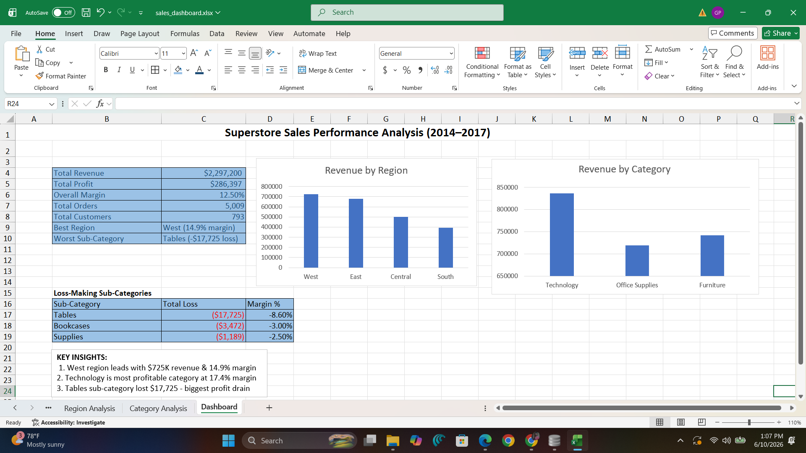

# Superstore Sales Performance Analysis
### SQL - Excel - Business Intelligence - Data Storytelling

---

## Why I Built This

As someone pursuing a Business Analyst role, I wanted to go beyond theory and actually do what BAs do every day - take raw business data, ask the right questions, and turn the answers into decisions that matter.

I picked a retail sales dataset covering 4 years of transactions and treated it like a real client engagement. I didn't just query the data - I built a business story around it: where is this company making money, where is it losing money, and what should leadership do about it?

---

## The Business Problem

The company generated **$2.3 million in revenue** across 4 years and **5,009 orders** from **793 customers** across 4 US regions. On the surface that looks healthy. But when I dug into the numbers, I found something that should concern any executive - the business is growing its revenue while quietly losing money on entire product lines.

My job was to find out where, why, and what to do about it.

---

## Tools and Approach

| Tool | How I used it |
|------|--------------|
| SQL (SQLite - DB Browser) | Wrote 8 queries to extract insights from 9,994 rows of raw data |
| Microsoft Excel | Built a dashboard with KPI summary, charts and loss analysis |
| Python (pandas) | Validated query results and calculated aggregations |

---

## What I Found

### 1. The West region is the star - Central is quietly struggling

When I broke revenue down by region, West came out on top at **$725,457**. But revenue alone doesn't tell the full story. I looked at profit margin - and that's where Central stood out for the wrong reasons.

| Region | Revenue | Profit | Margin |
|--------|---------|--------|--------|
| West | $725,457 | $108,418 | 14.9% |
| East | $678,781 | $91,522 | 13.5% |
| Central | $501,239 | $39,706 | **7.9%** |
| South | $391,721 | $46,749 | 11.9% |

Central is generating solid revenue but keeping less than half the margin of the West. That 7-point gap doesn't happen by accident - it usually means sales reps are over-discounting to close deals. That's a management and pricing problem, not a demand problem.

---

### 2. Furniture looks good on the revenue line - but it's bleeding profit

This was the most important finding of the entire analysis. Furniture generated **$742K in revenue** - almost as much as Technology. But when I calculated the margin, Furniture was only keeping **2.5 cents of every dollar** in sales as profit.

| Category | Revenue | Profit | Margin |
|----------|---------|--------|--------|
| Technology | $836,154 | $145,454 | **17.4%** |
| Office Supplies | $719,047 | $122,490 | **17.0%** |
| Furniture | $741,999 | $18,451 | **2.5%** |

I went deeper. Within Furniture, I found 3 sub-categories that weren't just low margin - they were **actively losing money** on every single sale:

| Sub-Category | Total Sales | Total Loss | Margin |
|-------------|-------------|------------|--------|
| Tables | $206,965 | **-$17,725** | -8.6% |
| Bookcases | $114,880 | **-$3,472** | -3.0% |
| Supplies | $46,673 | **-$1,189** | -2.5% |

The Tables sub-category alone lost **$17,725**. That means every time a sales rep closed a Tables deal, the company lost money. The more Tables they sold, the worse off they were. This is the definition of a pricing problem - and it's hiding behind a healthy-looking revenue number.

---

### 3. The business is growing - but not as efficiently as it looks

Revenue grew from **$484K in 2014 to $733K in 2017** - a 51% increase over 3 years. That's impressive. But when I tracked profit margin year by year, I noticed something:

| Year | Revenue | Profit | Margin |
|------|---------|--------|--------|
| 2014 | $484,247 | $49,543 | 10.2% |
| 2015 | $470,532 | $61,618 | 13.1% |
| 2016 | $609,205 | $81,795 | 13.4% |
| 2017 | $733,215 | $93,439 | 12.7% |

2017 had the highest revenue ever - but the margin actually dropped compared to 2015 and 2016. That tells me the growth in 2017 was partly driven by discounting and volume deals rather than genuine demand. A business can't sustain growth that way.

I also found that **November is consistently the peak month** - November 2017 hit **$118,447 in a single month**. That's a seasonal pattern the business can plan around.

---

### 4. Corporate customers are the most valuable per transaction

| Segment | Customers | Revenue | Avg Order Value |
|---------|-----------|---------|----------------|
| Consumer | 409 | $1,161,401 | $223 |
| Corporate | 236 | $706,146 | $234 |
| Home Office | 148 | $429,653 | $241 |

Consumer customers make up the majority but Corporate and Home Office customers spend more per order. With fewer customers generating higher value, retention matters more for those segments.

---

## My Recommendations

**1. Stop discounting Tables - or stop selling them**

Tables lost $17,725 on $206K of sales. A 10% price increase or a hard cap on discounts for this sub-category would likely recover the entire loss. If volume drops significantly at a higher price, that's fine - the current volume is destroying value.

**2. Audit the Central region's discount practices**

A 7-point margin gap between West and Central is too large to ignore. I'd recommend pulling a breakdown of discount rates by sales rep in the Central region and setting a maximum discount threshold tied to product margin.

**3. Shift marketing investment toward Technology in West and East**

Technology has the highest margin (17.4%) and the West and East are the strongest performing regions. Targeted upsell campaigns for Technology products aimed at existing Corporate customers in these two regions would compound profit without needing new customer acquisition.

---

## The SQL Queries

I wrote 8 queries to answer 8 specific business questions:

| Query | Business Question |
|-------|------------------|
| Q1 | Which region generates the most revenue and holds the best margin? |
| Q2 | Which products should the sales team prioritise? |
| Q3 | Is there a seasonal pattern in monthly revenue? |
| Q4 | Which product category is most profitable? |
| Q5 | Which customer segment delivers the highest value? |
| Q6 | Which sub-categories are actively losing money? |
| Q7 | Is the business growing year over year - and is that growth healthy? |
| Q8 | Which shipping mode is used most and does it correlate with order value? |

All queries are in `sales_queries.sql` - each one includes a comment explaining the business question it answers.

## Repository Structure

superstore-sales-analysis/
├── superstore_full.csv       <- Raw dataset (9,994 records)
├── sales_queries.sql         <- All 8 SQL queries with business context
├── sales_dashboard.xlsx      <- Excel dashboard with charts and KPI summary
├── dashboard.png             <- Dashboard screenshot
└── README.md

---

## Key Takeaway

The headline number - $2.3M in revenue - looks strong. But underneath it, the business has a Furniture problem, a Central region problem, and a discounting problem that's slowly eating into profit margins. None of this was visible from the top line. It only became visible when you asked the right questions of the data.

That's what this project is about.

---

*Business Analyst Portfolio - Tools: SQL - Excel - Python*

---

## Repository Structure
